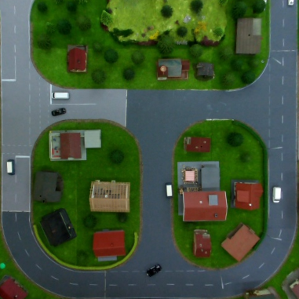
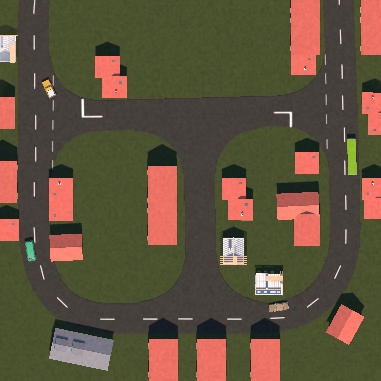
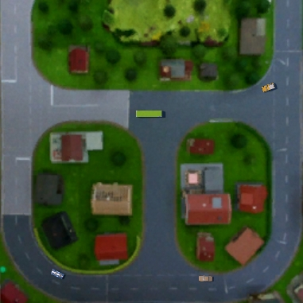

# microwunderland_training_images
## Datasets:
The ready to use versions of all datasets where creteated with the following parameters for preprocessing and augemntation:

Pre-processing:
+ Auto-orientation of pixel data (with EXIF-orientation stripping)
+ Resize to 640x640 (Stretch)

Augemntation:
+ 50% probability of horizontal flip
+ 50% probability of vertical flip
+ Random rotation of between -15 and +15 degrees
+ Random brigthness adjustment of between -15 and +15 percent

### real
Contains images directly captured by the overhead cameras in the microwunderland. The dataset contains the raw captures, an undistorted version of the images and a ready to use dataset of the undistorted images with additional augmentation and labeling, split in test train and valid

### sim
Contains images synthesised in a unity simulation of the microwunderland. The Dataset contains the raw captures and a ready to use dataset, with additional augmentation and labeling, split in test train and valid

### hybird
Contains an image that was created using a mix of real image data from the microwunderland and the simulation. The Vehicles in the images are 3D-Models the ground plane is an undistorted picture of the microwunderland through the overhead camera. The Dataset contains the raw captures and a ready to use dataset, with additional augmentation and labeling, split in test train and valid

### fusion
Contains a ready to use dataset with a mix of images from all above ready to use datasets. The Data set contains labels and augmentations and is also split into test, train and valid data.
